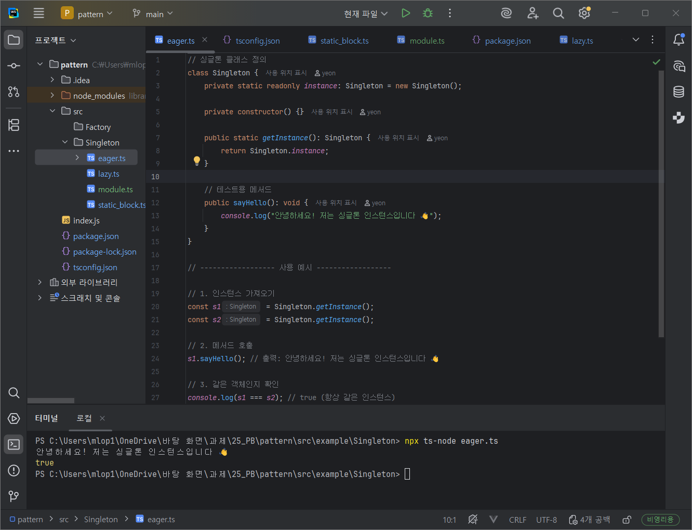
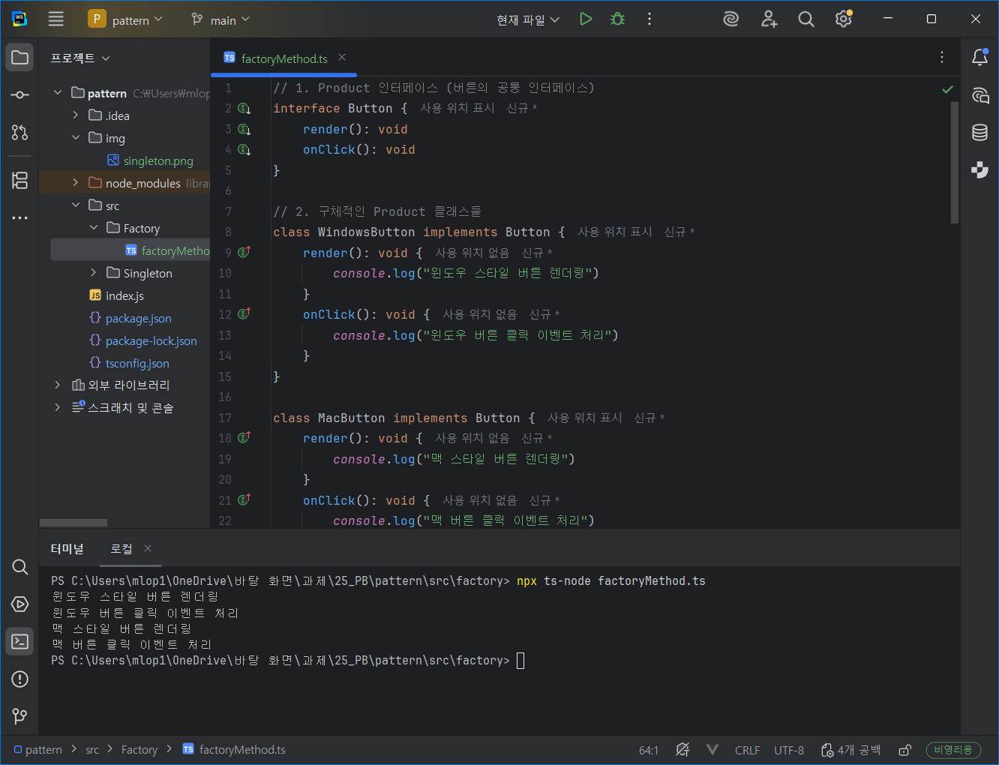
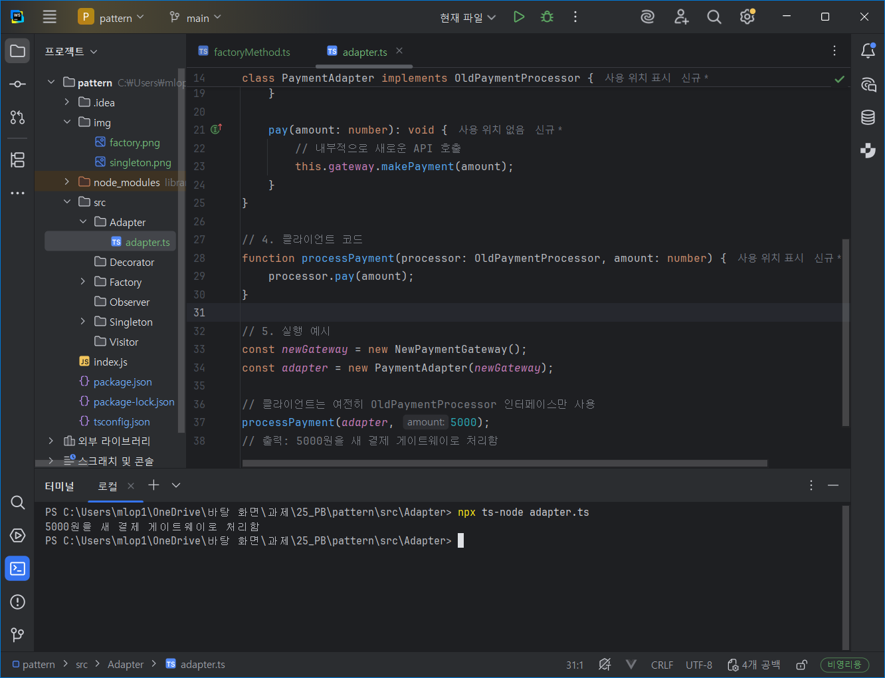
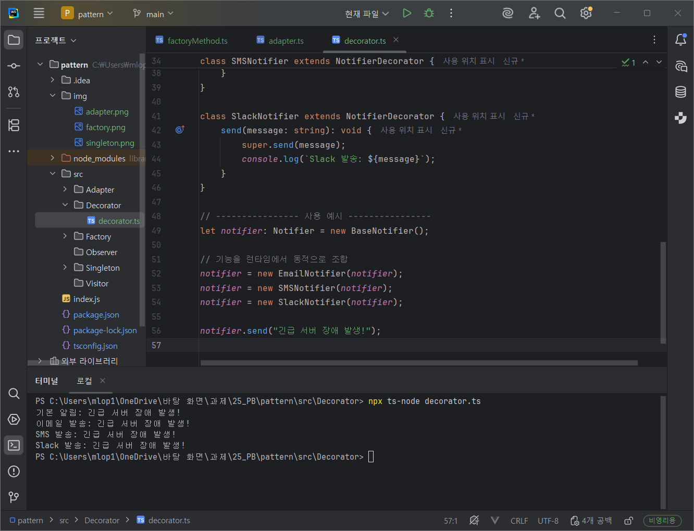
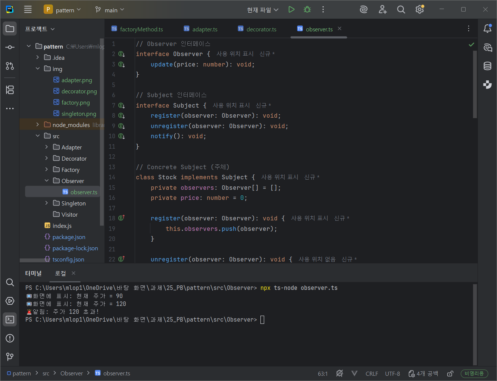
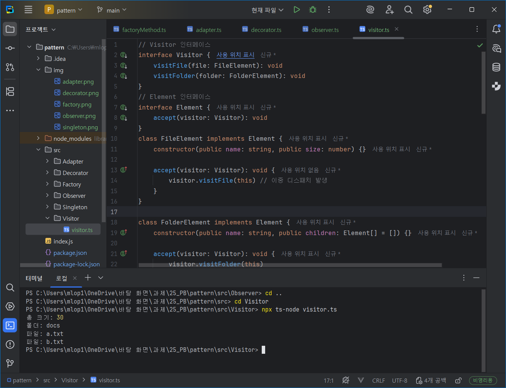
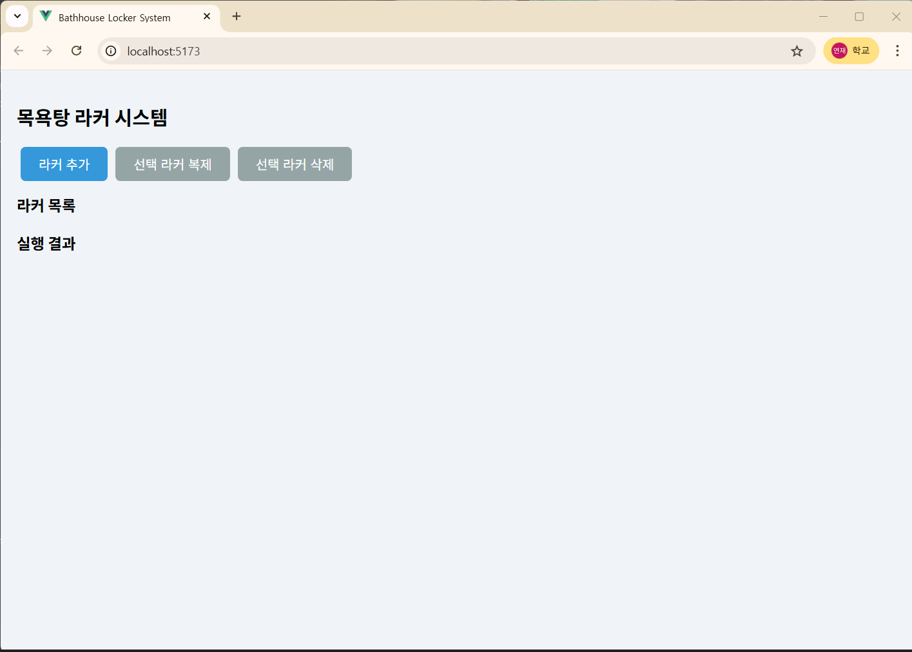
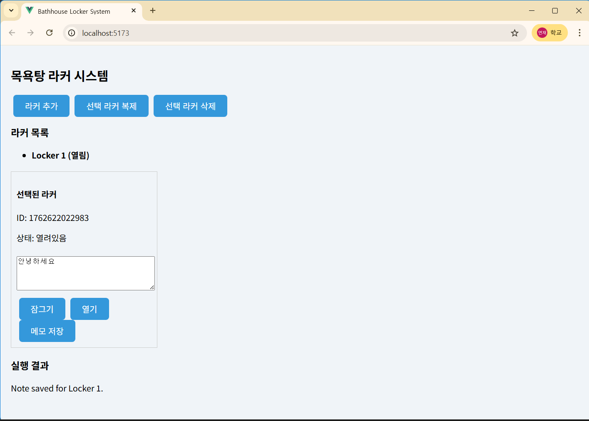
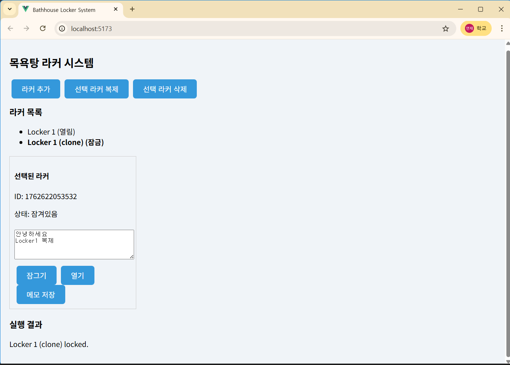
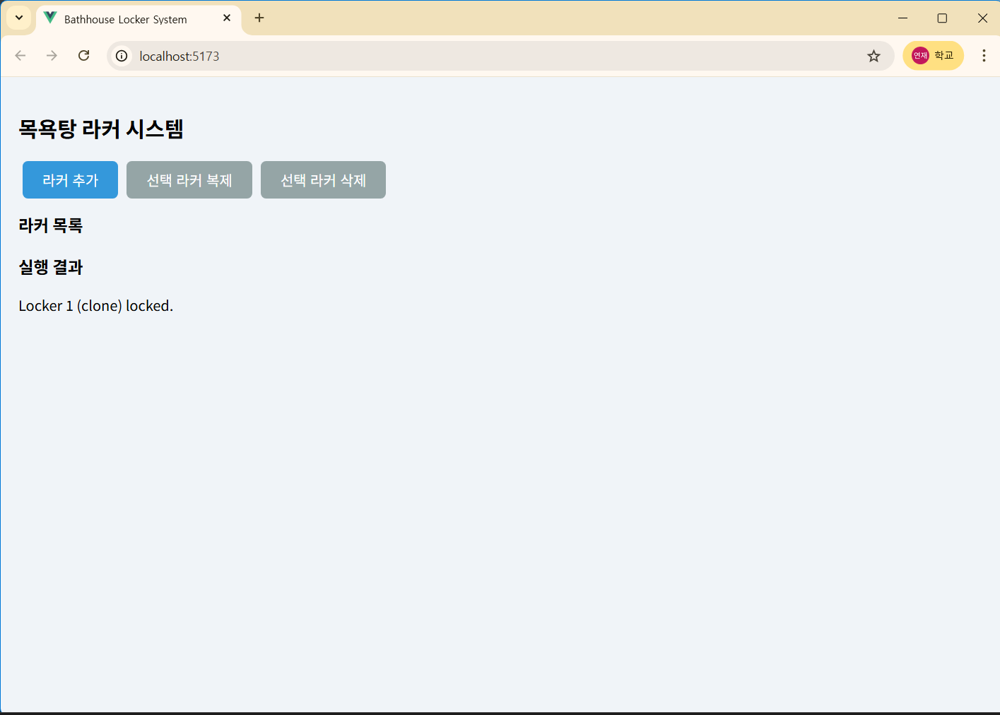

# 객체지향 디자인 패턴 실습
---
## 1. 기본 예제 실행 결과 스크린샷

`/example/Singleton/eager.ts` 

`/example/Factory/factoryMethod.ts` 

`/example/Adapter/adapter.ts` 

`/example/Decorator/decorator.ts` 

`/example/Observer/observer.ts` 

`/example/Visitor/visitor.ts` 

## 실행 방법

각 패턴 예제 폴더 안의 `.ts` 파일 실행 예시
```
cd src/Factory
npx ts-node factory.ts
```

---

## 2. 실습 구현 과제 - Bathhouse Locker System

## 프로젝트 개요
목욕탕 라커 시스템을 Vue 3 + TypeScript로 구현한 웹 앱입니다.  
사용자는 라커를 추가, 복제, 삭제할 수 있으며, 라커 잠금/해제와 메모 저장 기능을 제공합니다.  
디자인 패턴 학습용 실습 프로젝트로, 다음 패턴을 적용했습니다:

- **Prototype Pattern**: 기존 라커를 복제하여 새 라커 생성
- **Facade Pattern**: 라커 잠금/해제/메모 저장 등의 복잡한 기능을 단순한 인터페이스로 제공
- **Command Pattern**: 사용자의 라커 잠금/해제/메모 저장 명령을 객체로 캡슐화

## 설치 및 실행 방법

1. 저장소 클론
`git clone <your-repo-url>`
`cd pattern`
2. 의존성 설치
`npm install`
3. 개발 서버 실행
`npm run dev`

## 기능

### 1. 초기 화면 및 라커 추가
- 프로젝트 실행 후 처음 보는 화면
- "라커 추가" 버튼 클릭 시 새로운 라커가 목록에 추가됨
  

### 2. 라커 메모 저장
- 특정 라커 선택 후 메모 입력
- "메모 저장" 버튼 클릭 시 해당 라커에 메모가 저장됨
  

### 3. 라커 잠금 및 복제
- 선택한 라커 잠금 가능
- 잠금 상태인 라커를 선택하여 "복제" 버튼 클릭 시 새로운 라커 생성 
  

### 4. 라커 삭제
- 선택한 라커를 "삭제" 버튼 클릭으로 제거
- 목록에서 해당 라커가 사라짐
  


